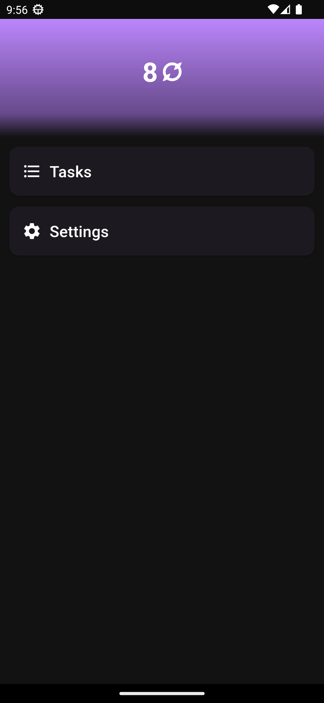
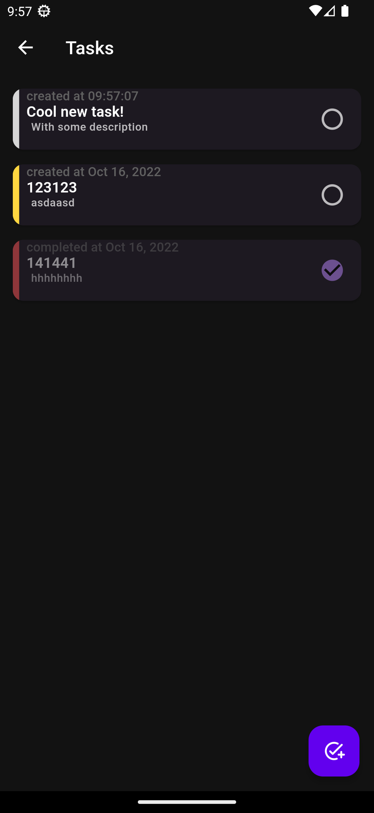

#  **Not Zero**

<a href="./LICENSE.md"></a>

> Currently under active development and doesn't have anything very interesting to show.
>
> More information will be in the near future.

Not Zero is a free cross-platform application developed with [flutter](https://flutter.dev) that aims to motivate people to do everyday tasks using gamification.

## Project status and roadmap

Project is now developing by the single person, so development is not very fast.
It currently at very early stage, can contain breaking changes **(including a possibility of user data loss)**.

Here is roadmap of project and what features are necessary to "complete" each stage:

<details>
<summary> Alpha </summary>

- [x] Stable app's architecture
- [x] Home screen
- [x] Tasks (and local storage for them)
- [x] "About" screen
- [x] Light and dark themes
- [x] App branding (logo, icons, posters)
- [x] Stable database version
- [x] Automatic builds and basic packaging
- [x] Export and import of app's data
- [x] Basic stats
- [ ] Tags & Sublists `(in progress)`
- [ ] Guides
</details>

<details>
<summary> Beta </summary>

- [ ] Release in Google Play
- [ ] Release in F-Droid
- [ ] Advanced stats (weekly, monthly statistics)
- [ ] Combos
- [ ] Habits
- [ ] Achievements
</details>

<details>
<summary> Stable release </summary>

- [ ] Notes
- [ ] Adaptation for iOS
- [ ] Release in App Store
- [ ] Adaptation of app for desktop
- [ ] Release on Linux
- [ ] Release on Windows
</details>

## Screenshots




## Building and running

First of all app is built using Flutter SDK.
To install it follow [**the official guide**](https://docs.flutter.dev/get-started/install).

```bash
# For installing basic dependencies, configuring flutter version, generating necessary code
# Make sure you added "$HOME/.pub-cache/bin" to your PATH because it is necessary for FVM
make gen

# Run flutter app to any available device using already configured flutter version
make run

# Run app tests
make test
```

SQLite3 is required for this app to function.
On Android and iOS platforms it works out of the box: sqlite lib already included in the package.
For web you have to include `sql-wasm` library.
It can be done by simply run `make web/sql-wasm.js` command.
For Linux `libsqlite3`, `libgtk-3-0`, `libblkid1`, `liblzma5` packages are required.
On Debian-based distributions can be installed using a single command:

```bash
sudo apt-get install libgtk-3-0 libblkid1 liblzma5 libsqlite3
```

<!--
TODO Add any words about usage of sql.js from here: https://github.com/sql-js/sql.js
-->
