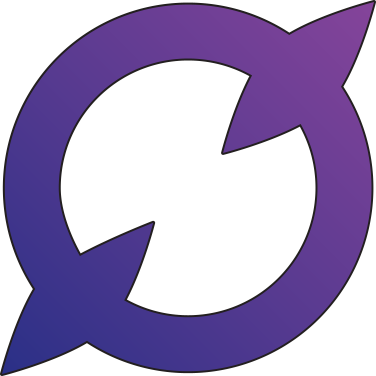

#  **Not Zero**

<a href="./LICENSE.md"></a>

> Currently under active development and doesn't have anything very intresting to show.
>
> More information will be in the near future.

Not Zero is a free crossplatform application developed with [flutter](https://flutter.dev) that aims to motivate people to do everyday tasks using gamification.

## Project status and roadmap

Project is now developing by the single person, so development is not very fast.
It currently at very early stage, I would like to call it **alpha**, but it is more like **pre-alpha**.

Here is roadmap of project and what features are necessary to "complete" each stage:

### _Alpha_

- [x] Stable app's architecture **[8 points]**
- [ ] Home screen `(in progress)`  **[5 points]**
- [x] Tasks (and local storage for them) **[8 points]**
- [ ] Settings  `(in progress)` **[5 points]**
- [ ] "About" screen **[5 points]**
- [x] Light and dark themes **[3 points]**
- [ ] App branding (logo, icons, posters and screenshots) `(in progress)` **[5 points]**

### _Beta_

- [ ] Export and import of app's data
- [ ] Notes
- [ ] Animations
- [ ] Combos
- [ ] Release in Google Play
- [ ] Release in F-Droid

... and probably some other stuff will be added here

### _Stable release_

- [ ] Advanved stats (weekly, monthly statistics)
- [ ] Achievements
- [ ] Habbits
- [ ] Adaptation for iOS
- [ ] Release in App Store
- [ ] Adaptation of app for desktop
- [ ] Release on Linux
- [ ] Release on Windows

... and probably some other stuff will be added here

## Building and running

```bash
# For installing basic dependencies, configuring flutter version, generating neccesary code
# Make sure you added "$HOME/.pub-cache/bin" to your PATH because it is necessary for FVM
make config

# Run flutter app to any available device using already configured flutter version
make run

# Run app tests
make test
```
