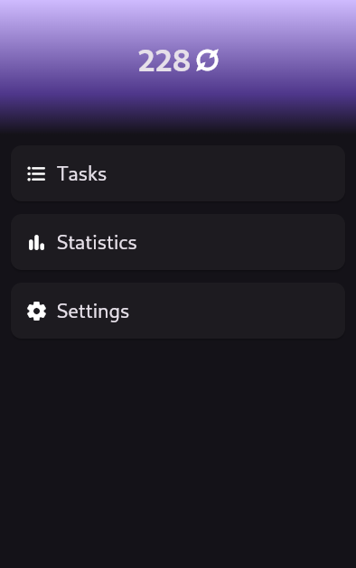
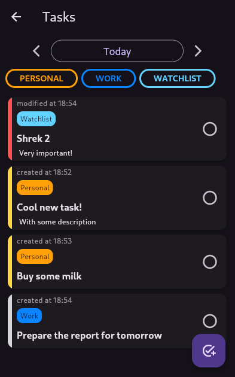
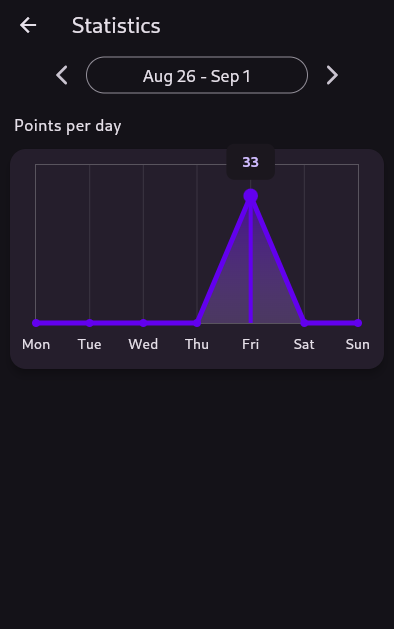

#  **Not Zero**

<a href="./LICENSE.md"></a>

> Currently under active development and doesn't have anything very interesting to show.
>
> More information will be in the near future.

Not Zero is a free cross-platform application developed with [flutter](https://flutter.dev) that aims to motivate people to do everyday tasks using gamification.

## Project status and roadmap

The project is currently being developed by only one person and is at a very early stage of development. There may be many experimental and disruptive changes.

Development is divided into several stages, with specific features planned for each stage. Major progress and current goals can be viewed in [repository Milestones](https://github.com/debils-tech/not_zero/milestones). The current roadmap is as follows:

<details>
<summary> Alpha </summary>

- [x] Stable app's architecture
- [x] Home screen
- [x] Tasks (and local storage for them)
- [x] "About" screen
- [x] Light and dark themes
- [x] App branding (logo, icons, posters)
- [x] Stable database version
- [x] Automatic builds and basic packaging
- [x] Export and import of app's data `(now broken 😢)`
- [x] Basic stats
- [x] Tags & Sublists
- [ ] Make app ready for data synchronization
- [ ] Tasks of the "do it someday" type
- [ ] Habits
- [ ] Better stats
- [ ] "Start your day" and "end your day" features

</details>

<details>
<summary> Beta </summary>

*The future is blurry here...*

- [ ] Release in F-Droid
- [ ] Onboarding
- [ ] Some backend for the app *(still local-only approach)*
- [ ] Release in Google Play
- [ ] Adaptation for iOS
- [ ] Release in App Store
- [ ] Data synchronization *(huge ⭐, more info later)*
- [ ] Adaptation of app for desktop
- [ ] Release on Linux
- [ ] Advanced stats (weekly, monthly statistics)
- [ ] General gamification goal *(huge ⭐, more info later)*
- [ ] Social features *(huge ⭐, more info later)*

</details>

<details>
<summary> Sometime later... </summary>

*The future is even more blurry here...*

- [ ] Notes
- [ ] Release on MacOS
- [ ] Release on Windows

*More plans will be here after alpha release...*

</details>

## Screenshots





## Building and running

First of all app is built using Flutter SDK.
To install it follow [**the official guide**](https://docs.flutter.dev/get-started/install).

```bash
# First, get all the dependencies
dart run melos bootstrap

# Go to the flutter app directory
cd apps/not_zero_app
# Run the app
flutter run
```

SQLite3 is required for this app to function.
On Android, iOS, Linux platforms it works out of the box: sqlite lib already included in the package. Other platforms wasn't tested yet.

For backup feature to work properly on Linux it is required to have dialog library be installed.
It can be either `zenity` (for GTK), `qarma` (for Qt), `kdialog` (for KDE).
